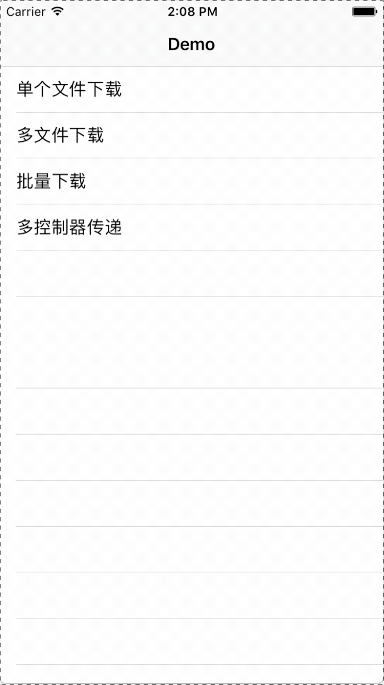
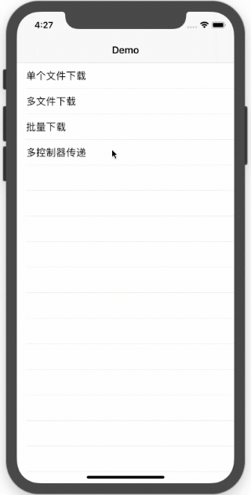

<div align="center">
  
</div>

<p align="center">
  <a href="README.md"><strong>English</strong></a> |
  <a href="README.zh.md"><strong>简体中文</strong></a>
</p>

<p align="center">
  <a href="https://cocoapods.org/pods/Tiercel"></a>
  <a href="https://swift.org/package-manager/"></a>
  <a href="https://swiftpackageindex.com/Danie1s/Tiercel"></a>
  <a href="https://swiftpackageindex.com/Danie1s/Tiercel"></a>
  <a href="https://github.com/matteocrippa/awesome-swift"></a>
  <a href="LICENSE"></a>
</p>

<p align="center">
  Tiercel 是一个面向生产环境的纯 Swift iOS 下载框架，专注于后台下载、重启恢复、断点续传，以及基于 <code>URLSession</code> 的下载任务编排。
</p>

<p align="center">
  Tiercel 已被 <a href="https://swiftpackageindex.com/Danie1s/Tiercel">Swift Package Index</a> 收录，并被 <a href="https://github.com/matteocrippa/awesome-swift">awesome-swift</a> 推荐。
</p>

<p align="center">
  如果 Tiercel 对你的下载场景有帮助，可以点一个 Star，让更多 iOS 开发者更容易发现它。
</p>

## 为什么团队会选择 Tiercel

- 基于 `URLSession` 的原生风格后台下载能力。
- 通过持久化任务信息和 resume data，在应用重启后恢复下载。
- 支持开始、暂停、取消、删除，以及批量任务操作。
- 支持多个 `SessionManager` 实例，方便隔离不同下载业务。
- 支持蜂窝网络、受限网络和高成本网络等策略配置。
- 内置下载速度、剩余时间与文件校验回调。
- 线程安全的内部状态管理，更适合长生命周期下载场景。

## 适合用 Tiercel 的场景

- 你需要在应用重启后恢复下载任务。
- 你有多个下载队列、不同业务域，或者不同产品模块需要隔离。
- 你希望批量管理下载任务，而不是零散地手动拼装逻辑。
- 你想要比原生 `URLSessionDownloadTask` 更高层的 API，但底层仍然使用苹果原生下载体系。
- 你希望团队成员能通过现成 Demo 很快评估这个框架。

## 能力一览

| 你需要的能力 | 只用原生 `URLSession` | Tiercel |
| --- | --- | --- |
| 后台下载 | 只有底层能力 | 更高层的管理器和任务模型 |
| 应用重启恢复 | 需要自己做持久化 | 内置任务元数据和 resume data 持久化 |
| 批量操作 | 需要自己编排 | 提供批量下载和管理器级控制 |
| 下载域隔离 | 需要自定义架构 | 支持多个隔离的 `SessionManager` |
| 进度与校验回调 | 需要手写 | 内置进度、速度、剩余时间和校验 API |

## 安装

### CocoaPods

```ruby
platform :ios, '12.0'
use_frameworks!

target 'YourTargetName' do
  pod 'Tiercel'
end
```

然后执行：

```bash
pod install
```

### Swift Package Manager

在 Xcode 中选择 `File > Add Package Dependencies...`，然后使用：

```text
https://github.com/Danie1s/Tiercel.git
```

### 手动集成

将 `Sources` 目录拖入你的工程，并确保这些文件被加入到目标 target 中。

## 快速开始

```swift
import Tiercel

var configuration = SessionConfiguration()
configuration.allowsCellularAccess = true
configuration.maxConcurrentTasksLimit = 3

let manager = SessionManager("downloads", configuration: configuration)

let task = manager.download("https://example.com/video.mp4")

task?.progress(onMainQueue: true) { task in
    print("progress:", task.progress.fractionCompleted)
}.success { task in
    print("saved to:", task.filePath)
}.failure { _ in
    print("download failed")
}
```

你既可以通过 URL 控制下载，也可以直接操作任务实例：

```swift
let url = "https://example.com/video.mp4"

manager.start(url)
manager.suspend(url)
manager.cancel(url)
manager.remove(url, completely: false)

if let task = task {
    manager.start(task)
    manager.suspend(task)
    manager.cancel(task)
    manager.remove(task, completely: false)
}
```

Tiercel 也支持批量创建并开始下载任务：

```swift
let urls = [
    "https://example.com/episode-1.mp4",
    "https://example.com/episode-2.mp4"
]

let tasks = manager.multiDownload(urls)
print(tasks.count)
```

## 后台下载与重启恢复

Tiercel 会将任务状态和 resume data 持久化到磁盘，因此应用重新启动后可以恢复下载。如果用户手动强制结束应用，iOS 会停止后台执行；当应用再次启动后，Tiercel 可以从已保存的状态中恢复符合条件的下载任务。

为了支持原生后台 session 回调，需要在 `AppDelegate` 中把 completion handler 交给对应的 `SessionManager`：

```swift
let downloadManagers = [managerA, managerB]

func application(_ application: UIApplication,
                 handleEventsForBackgroundURLSession identifier: String,
                 completionHandler: @escaping () -> Void) {
    for manager in downloadManagers where manager.identifier == identifier {
        manager.completionHandler = completionHandler
        break
    }
}
```

## 网络策略与文件校验

`SessionConfiguration` 可以针对不同业务场景调整网络行为：

```swift
var configuration = SessionConfiguration()
configuration.maxConcurrentTasksLimit = 3
configuration.allowsCellularAccess = true
configuration.allowsConstrainedNetworkAccess = true
configuration.allowsExpensiveNetworkAccess = true

let manager = SessionManager("downloads", configuration: configuration)
```

当你需要保证文件完整性时，也可以在下载完成后进行校验：

```swift
task?.validateFile(code: "9e2a3650530b563da297c9246acaad5c",
                   type: .md5,
                   onMainQueue: true) { task in
    if task.validation == .correct {
        print("file is valid")
    } else {
        print("file is invalid")
    }
}
```

## 兼容性

- 当前 podspec 版本：`3.2.9`
- 最低平台要求：`iOS 12.0+`
- 语言基线：`Swift 5.0+`
- 集成方式：CocoaPods、Swift Package Manager、手动集成

## Demo

打开 `Demo/Tiercel-Demo.xcodeproj`，可以快速体验：

- 单文件下载
- 批量下载
- 多下载管理器隔离
- 后台 session 事件处理
- 文件校验与进度回调




## 文档与链接

- [Wiki](https://github.com/Danie1s/Tiercel/wiki)
- [Tiercel 3.0 迁移指南](https://github.com/Danie1s/Tiercel/wiki/Tiercel-3.0-%E8%BF%81%E7%A7%BB%E6%8C%87%E5%8D%97)
- [Objective-C Bridge](https://github.com/Danie1s/TiercelObjCBridge)
- [贡献指南（英文）](CONTRIBUTING.md)
- [安全策略](SECURITY.md)

## 仓库结构

- `Sources/General`：核心的 session、task、cache 与状态管理逻辑
- `Sources/Extensions`：框架内部使用的轻量扩展
- `Sources/Utility`：文件校验和 resume data 相关工具
- `Demo`：用于评估与手动验证的示例应用

## License

Tiercel 基于 MIT 协议开源，详情请查看 [LICENSE](LICENSE)。
